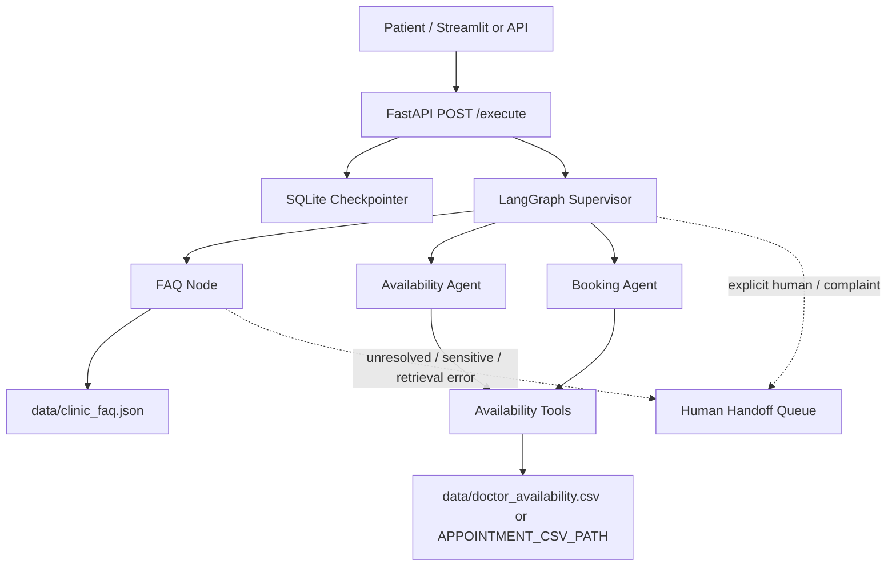

# Clinic AI Customer Service

A prototype multi-agent clinic customer-service system built with LangGraph, LangChain, FastAPI, Streamlit, and CSV-backed appointment data.

The system handles two separate domains:

- FAQ/knowledge questions use the configured `CLINIC_FAQ_PATH` through semantic embedding retrieval with a persisted local vector index and grounded no-answer behavior. The default remains `data/clinic_faq.json`.
- Appointment availability, booking, cancellation, and rescheduling use structured tools in `toolkit/toolkits.py` against the configured appointment CSV.

Do not mix these paths. Appointment availability is transactional operational state, not FAQ/RAG content.

## Current Status

Implemented and tested in this repository:

- Supervisor routing for FAQ, availability, book, cancel, reschedule, and fallback intents.
- Dedicated FAQ node with grounded answers from the configured `CLINIC_FAQ_PATH` (defaults to `data/clinic_faq.json`), source IDs when present, and explicit no-answer behavior.
- Medical-advice boundary response for FAQ requests.
- Availability lookup by doctor or specialization.
- Guarded appointment booking, cancellation, and atomic rescheduling.
- CSV schema/state validation, lock-file coordination, and atomic CSV replacement for local prototype use.
- FastAPI app with `/health`, `/execute`, request IDs, safe validation errors, and safe dependency/agent failure responses.
- SQLite conversation memory using hashed patient/session thread keys.
- Streamlit chat UI with masked patient-ID input, chat transcript, loading/error feedback, safe text rendering, session reset, configurable API URL/timeout, and pending human-escalation status display.
- Human escalation prototype with deterministic triggers, privacy-minimized local SQLite handoff queue, case IDs/statuses, and truthful pending responses.
- Pytest suite and GitHub Actions CI for dependency checks, compile checks, and tests.

Not implemented:

- No production authentication/authorization.
- No deployment/CD pipeline.
- No deterministic server-side approval token for appointment mutations; confirmation is currently an LLM instruction.
- Phase 7 semantic RAG implementation is present: embeddings, persistent vector index, source metadata, content-fingerprint rebuilds, grounded thresholding, and deterministic retrieval evaluation.
- No approved clinic FAQ facts yet; `data/clinic_faq.json` remains intentionally empty until clinic-owned content is supplied.
- No production transactional database for appointments.
- No external human-contact channel yet; Phase 8 uses a local prototype queue only.

## Data Boundaries

`data/doctor_availability.csv` is historical legacy appointment data from the prototype. It must not be presented as current live clinic availability unless an authorized operator has refreshed and approved it.

Tests must use synthetic fixtures or temporary files. Do not replace `data/doctor_availability.csv` with `tests/fixtures/synthetic_appointments.csv`.

A separate disposable fake-data kit lives in `deployment/demo_data/`. Run `.\deployment\prepare_demo_data.ps1` in PowerShell to populate an ignored `runtime-data/` directory for a local Compose demo. The script requires explicit confirmation and refuses to overwrite an existing `runtime-data/`. All demo FAQ answers and appointment slots are fake, and must never be described as real clinic policies or live availability. Details: `deployment/demo_data/README.md`.

`data/clinic_faq.json` must contain only clinic-approved facts. Do not infer hours, address, services, pricing, insurance, or policies from appointment-slot data.

## Architecture



Key files:

- `agent.py`: LangGraph state, supervisor, FAQ node, availability node, booking node.
- `knowledge_base.py`: FAQ validation, lexical baseline, semantic embeddings, persistent vector indexing, retrieval thresholds, source metadata, and evaluation.
- `toolkit/toolkits.py`: appointment CSV validation and mutation tools.
- `main.py`: FastAPI app factory, health check, execution endpoint, SQLite checkpointer.
- `streamlit_ui.py`: Streamlit chat frontend and user-facing error/escalation states.
- `ui_helpers.py`: independently tested patient-ID validation, response extraction, and escalation metadata parsing.
- `support/handoff.py`: local human-handoff queue, trigger detection, redacted summaries, and case lifecycle helpers.
- `docs/`: operations notes for FAQ content, knowledge retrieval, memory, human escalation, and CI/CD.
- `tests/`: synthetic unit/API/integration tests.

## Configuration

Required for a real LLM-backed app run:
- OPENAI_API_KEY for the model provider.
- API_ACCESS_TOKEN for authenticated calls to POST /execute.

Generate a token locally with:

```powershell
python -c "import secrets; print(secrets.token_urlsafe(32))"
```

Store the generated token only in your untracked local .env or a deployment secret store. The API rejects /execute requests when a token has not been configured. ALLOW_UNAUTHENTICATED_LOCAL_DEV=true is an explicit local-only escape hatch and must not be used in deployment.

Optional:

```text
APPOINTMENT_CSV_PATH=path/to/appointments.csv
CLINIC_FAQ_PATH=path/to/clinic_faq.json
CHECKPOINT_DB_PATH=data/conversations.sqlite3
LOG_LEVEL=INFO
FAQ_EMBEDDING_MODEL=text-embedding-3-small
FAQ_RAG_INDEX_PATH=data/faq_index
HANDOFF_DB_PATH=data/human_handoffs.sqlite3
API_URL=http://127.0.0.1:8003/execute
API_TIMEOUT_SECONDS=45
API_ACCESS_TOKEN=replace_with_a_long_random_secret
ALLOW_UNAUTHENTICATED_LOCAL_DEV=false
OPENAI_CHAT_MODEL=gpt-4o
OPENAI_REQUEST_TIMEOUT_SECONDS=30
OPENAI_MAX_RETRIES=2
```

For tests, fixtures and monkeypatches avoid real OpenAI calls and avoid mutating canonical data.

## Install

```bash
python -m venv .venv
# Windows:
.venv\Scripts\activate
# macOS/Linux:
source .venv/bin/activate
python -m pip install --upgrade pip
python -m pip install -r requirements-runtime.txt
# For local test/development work:
python -m pip install -r requirements-test.txt
```

The runtime requirements are pinned separately from the historical research requirements.txt, which includes optional CV/ML libraries not needed to run the clinic API and UI.

## Run

Start the API:

```bash
uvicorn main:app --host 127.0.0.1 --port 8003 --reload
```

Start the UI:

```bash
streamlit run streamlit_ui.py
```

Raw API example (for the disposable demo schedule only; the default legacy CSV is not a live schedule):

```bash
curl -X POST http://127.0.0.1:8003/execute ^
  -H "Content-Type: application/json" ^
  -H "X-API-Key: YOUR_API_ACCESS_TOKEN" ^
  -d "{\"id_number\": 9123456, \"session_id\": \"demo\", \"messages\": \"Is john doe available on 12-10-2026?\"}"
```

Use only synthetic/test patient IDs for local testing.

## Test

Focused Phase 7/8 checks:

```bash
python -m pytest tests/test_handoff.py tests/test_knowledge_base.py tests/test_faq.py tests/test_routing.py -q -p no:cacheprovider
```

Build the semantic FAQ index after supplying approved clinic content:

```bash
python -m knowledge_base --source data/clinic_faq.json --index-dir data/faq_index
```

Appointment tools:

```bash
python -m pytest tests/test_tools.py -q -p no:cacheprovider
```

API and memory:

```bash
python -m pytest tests/test_api.py tests/test_memory.py -q -p no:cacheprovider
```

Full suite:

```bash
python -m pytest -q -p no:cacheprovider
```

Compile check:

```bash
python -m compileall -q agent.py main.py streamlit_ui.py ui_helpers.py toolkit data_models utils knowledge_base.py support
```

## Deployment scaffold

The API/UI Docker and Compose scaffold is documented in `docs/PRODUCTION_READINESS.md`. Before running Compose, create `runtime-data/`, provision an approved FAQ at `runtime-data/clinic_faq.json`, and provide an authorized current `runtime-data/doctor_availability.csv` schedule. **Do not copy the committed historical prototype schedule into deployment.** Configure `OPENAI_API_KEY` and a strong `API_ACCESS_TOKEN` in a local untracked `.env` or managed deployment secrets. Compose publishes ports on localhost only by default.

## Documentation

- `docs/PRODUCTION_READINESS.md`: security configuration, container usage, release blockers, and checklist.
- `ROADMAP.md`: phase status, verification history, and remaining work.
- `docs/RAG_KNOWLEDGE_BASE.md`: knowledge-source boundaries and Phase 7 limitations.
- `docs/FAQ_CONTENT_GUIDE.md`: approved FAQ content process.
- `docs/CONVERSATION_MEMORY.md`: checkpoint persistence, retention, and deletion guidance.
- `docs/CI_CD.md`: current CI checks and deployment prerequisites.

## Production Notes

This is not yet production-clinic ready. Before real patient use, obtain clinic-approved FAQ facts and a verified current schedule, replace prototype API-token-only security with end-user authentication/authorization, define retention/deletion and encryption/access policies, connect human escalation to a real staffed channel, replace file/SQLite prototype stores for multi-host concurrency, enforce deterministic server-side mutation confirmation, and validate backups, monitoring, rate limits, deployment security, and rollback. See `docs/PRODUCTION_READINESS.md`.
