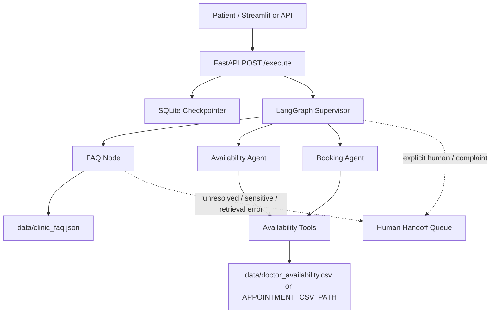

# Clinic AI Customer Service

A prototype multi-agent clinic customer-service system built with LangGraph, LangChain, FastAPI, Streamlit, and CSV-backed appointment data.

The system handles two separate domains:

- FAQ/knowledge questions use approved entries in `data/clinic_faq.json` through semantic embedding retrieval with a persisted local vector index and grounded no-answer behavior.
- Appointment availability, booking, cancellation, and rescheduling use structured tools in `toolkit/toolkits.py` against the configured appointment CSV.

Do not mix these paths. Appointment availability is transactional operational state, not FAQ/RAG content.

## Current Status

Implemented and tested in this repository:

- Supervisor routing for FAQ, availability, book, cancel, reschedule, and fallback intents.
- Dedicated FAQ node with grounded answers from `data/clinic_faq.json`, source IDs when present, and explicit no-answer behavior.
- Medical-advice boundary response for FAQ requests.
- Availability lookup by doctor or specialization.
- Guarded appointment booking, cancellation, and atomic rescheduling.
- CSV schema/state validation, lock-file coordination, and atomic CSV replacement for local prototype use.
- FastAPI app with `/health`, `/execute`, request IDs, safe validation errors, and safe dependency/agent failure responses.
- SQLite conversation memory using hashed patient/session thread keys.
- Streamlit chat UI with masked patient-ID input, chat transcript, loading/error feedback, safe text rendering, session reset, configurable API URL/timeout, and pending human-escalation status display.
- Human escalation prototype with deterministic triggers, privacy-minimized local SQLite handoff queue, case IDs/statuses, and truthful pending responses.
- Pytest suite and GitHub Actions CI for dependency checks, compile checks, and tests.

Not implemented:

- No production authentication/authorization.
- No deployment/CD pipeline.
- No deterministic server-side approval token for appointment mutations; confirmation is currently an LLM instruction.
- Phase 7 semantic RAG implementation is present: embeddings, persistent vector index, source metadata, content-fingerprint rebuilds, grounded thresholding, and deterministic retrieval evaluation.
- No approved clinic FAQ facts yet; `data/clinic_faq.json` remains intentionally empty until clinic-owned content is supplied.
- No production transactional database for appointments.
- No external human-contact channel yet; Phase 8 uses a local prototype queue only.

## Data Boundaries

`data/doctor_availability.csv` is historical legacy appointment data from the prototype. It must not be presented as current live clinic availability unless an authorized operator has refreshed and approved it.

Tests must use synthetic fixtures or temporary files. Do not replace `data/doctor_availability.csv` with `tests/fixtures/synthetic_appointments.csv`.

`data/clinic_faq.json` must contain only clinic-approved facts. Do not infer hours, address, services, pricing, insurance, or policies from appointment-slot data.

## Architecture



Key files:

- `agent.py`: LangGraph state, supervisor, FAQ node, availability node, booking node.
- `knowledge_base.py`: FAQ validation, lexical baseline, semantic embeddings, persistent vector indexing, retrieval thresholds, source metadata, and evaluation.
- `toolkit/toolkits.py`: appointment CSV validation and mutation tools.
- `main.py`: FastAPI app factory, health check, execution endpoint, SQLite checkpointer.
- `streamlit_ui.py`: Streamlit chat frontend and user-facing error/escalation states.
- `ui_helpers.py`: independently tested patient-ID validation, response extraction, and escalation metadata parsing.
- `support/handoff.py`: local human-handoff queue, trigger detection, redacted summaries, and case lifecycle helpers.
- `docs/`: operations notes for FAQ content, knowledge retrieval, memory, human escalation, and CI/CD.
- `tests/`: synthetic unit/API/integration tests.

## Configuration

Required for a real LLM-backed app run:

```text
OPENAI_API_KEY=...
```

Optional:

```text
APPOINTMENT_CSV_PATH=path/to/appointments.csv
CHECKPOINT_DB_PATH=data/conversations.sqlite3
LOG_LEVEL=INFO
FAQ_EMBEDDING_MODEL=text-embedding-3-small
FAQ_RAG_INDEX_PATH=data/faq_index
HANDOFF_DB_PATH=data/human_handoffs.sqlite3
API_URL=http://127.0.0.1:8003/execute
API_TIMEOUT_SECONDS=45
```

For tests, fixtures and monkeypatches avoid real OpenAI calls and avoid mutating canonical data.

## Install

```bash
python -m venv .venv
# Windows:
.venv\Scripts\activate
# macOS/Linux:
source .venv/bin/activate
python -m pip install --upgrade pip
python -m pip install -r requirements.txt
python -m pip install pytest
```

The pinned dependency set is heavy and includes optional libraries that are not exercised by the current runtime path.

## Run

Start the API:

```bash
uvicorn main:app --host 127.0.0.1 --port 8003 --reload
```

Start the UI:

```bash
streamlit run streamlit_ui.py
```

Raw API example:

```bash
curl -X POST http://127.0.0.1:8003/execute ^
  -H "Content-Type: application/json" ^
  -d "{\"id_number\": 1234567, \"session_id\": \"demo\", \"messages\": \"Is john doe available on 08-08-2024?\"}"
```

Use only synthetic/test patient IDs for local testing.

## Test

Focused Phase 7/8 checks:

```bash
python -m pytest tests/test_handoff.py tests/test_knowledge_base.py tests/test_faq.py tests/test_routing.py -q -p no:cacheprovider
```

Build the semantic FAQ index after supplying approved clinic content:

```bash
python -m knowledge_base --source data/clinic_faq.json --index-dir data/faq_index
```

Appointment tools:

```bash
python -m pytest tests/test_tools.py -q -p no:cacheprovider
```

API and memory:

```bash
python -m pytest tests/test_api.py tests/test_memory.py -q -p no:cacheprovider
```

Full suite:

```bash
python -m pytest -q -p no:cacheprovider
```

Compile check:

```bash
python -m compileall -q agent.py main.py toolkit data_models utils knowledge_base.py
```

## Documentation

- `ROADMAP.md`: phase status, verification history, and remaining work.
- `docs/RAG_KNOWLEDGE_BASE.md`: knowledge-source boundaries and Phase 7 limitations.
- `docs/FAQ_CONTENT_GUIDE.md`: approved FAQ content process.
- `docs/CONVERSATION_MEMORY.md`: checkpoint persistence, retention, and deletion guidance.
- `docs/CI_CD.md`: current CI checks and deployment prerequisites.

## Production Notes

Before using this with real patients, define clinic data ownership, refresh current schedules, replace CSV storage with transactional infrastructure as needed, implement authentication/authorization, establish retention/deletion processes, and add deterministic server-side confirmation for mutations.
