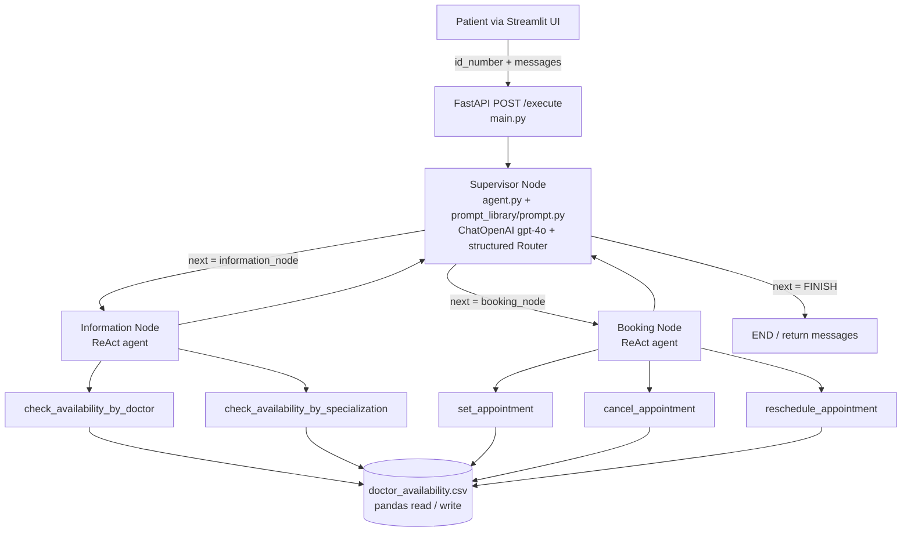

# Doctor Appointment Multi-Agent System

A supervisor-coordinated multi-agent system for dental appointment management, built with LangGraph, LangChain, OpenAI (`gpt-4o`), FastAPI, and Streamlit. It routes natural-language patient requests to specialized agents that check doctor availability and book, cancel, or reschedule appointments against a CSV-backed schedule.

## Overview

**Problem:** Handling appointment queries ("Is a dentist available tomorrow?", "Book me with Jane Smith at 10 AM", "Cancel/reschedule my slot") requires combining conversational understanding, structured date/ID validation, and stateful schedule lookups/updates.

**How it works:** A single FastAPI endpoint (`POST /execute`) accepts a patient ID number and a natural-language message, invokes a compiled LangGraph workflow (`DoctorAppointmentAgent.workflow()`), and returns the resulting conversation messages. A Streamlit page (`streamlit_ui.py`) provides a minimal form-based frontend over that endpoint.

**Architecture pattern:** Supervisor + two specialist ReAct agents:

- `supervisor` — classifies each turn with structured output (`Router`) and routes to `information_node`, `booking_node`, or `FINISH` (`END`).
- `information_node` — ReAct agent with availability-lookup tools.
- `booking_node` — ReAct agent with booking-mutation tools.

State is carried in a LangGraph `AgentState` (`messages`, `id_number`, `next`, `query`, `current_reasoning`). Each worker appends an `AIMessage` and returns control to `supervisor` until the supervisor emits `FINISH`.

## Features

Implemented in the current codebase — nothing more:

- Natural-language availability lookup by **doctor name** (`check_availability_by_doctor`).
- Natural-language availability lookup by **specialization** (`check_availability_by_specialization`).
- Appointment **booking** (`set_appointment`).
- Appointment **cancellation** (`cancel_appointment`).
- Appointment **rescheduling** (`reschedule_appointment`, implemented as cancel + book).
- Supervisor routing with structured output (`next: information_node | booking_node | FINISH` + `reasoning`).
- Pydantic validation for tool arguments:
  - `DateModel`: `DD-MM-YYYY`
  - `DateTimeModel`: `DD-MM-YYYY HH:MM`
  - `IdentificationNumberModel`: 7–8 digit integer ID
- FastAPI service (`main.py`) exposing `POST /execute`.
- Streamlit chat/form UI (`streamlit_ui.py`) that posts to the FastAPI service.
- CSV-backed schedule (`data/doctor_availability.csv`) manipulated with pandas.
- Development/prototype notebook (`notebook/multiagent_system.ipynb`).

Non-goals / not present: no authentication/authorization, no database server, no Docker, no CI/CD, no test suite, no migration tooling.

## Architecture



### Request lifecycle (`main.py` → `agent.py` → `toolkit/toolkits.py`)

1. Client sends `{"id_number": <int>, "messages": "<natural language>"}` to `POST /execute`.
2. `main.py` wraps `messages` in a LangChain `HumanMessage` and builds the initial graph state:
   `{"messages": [...], "id_number": ..., "next": "", "query": "", "current_reasoning": ""}`.
3. The graph is invoked with `recursion_limit: 20`.
4. `supervisor_node` prepends the supervisor `system_prompt`, injects `user's identification number is {id_number}`, captures the first-turn query verbatim, and calls the LLM with structured output (`Router`). It maps `FINISH` → `END`.
5. On the first turn only, the supervisor appends a `HumanMessage("user's identification number is ...")` to state along with `next`, `query`, and `current_reasoning`.
6. `information_node` / `booking_node` each build a `ChatPromptTemplate` (specialist system prompt + `{messages}` placeholder), create a ReAct agent via `create_react_agent`, invoke it on the current state, and append the last result as an `AIMessage(name="information_node" | "booking_node")` before returning to `supervisor`.
7. The final `response["messages"]` list is returned as `{"messages": ...}` JSON.

## Project Structure

```text
doctor-appoitment-multiagent/
├── agent.py                  # DoctorAppointmentAgent: AgentState, Router, supervisor/information/booking nodes, StateGraph workflow
├── main.py                   # FastAPI app: POST /execute, UserQuery model, graph invocation
├── streamlit_ui.py           # Streamlit frontend: ID + query form, POSTs to http://127.0.0.1:8003/execute
├── prompt_library/
│   ├── __init__.py
│   └── prompt.py             # Supervisor system_prompt, members_dict, routing rules
├── toolkit/
│   ├── __init__.py
│   └── toolkits.py           # 5 @tool functions over the availability CSV
├── data_models/
│   ├── __init__.py
│   └── models.py             # DateModel, DateTimeModel, IdentificationNumberModel (Pydantic)
├── utils/
│   ├── __init__.py
│   └── llms.py               # LLMModel wrapper: ChatOpenAI(model="gpt-4o"), OPENAI_API_KEY from .env
├── data/
│   └── doctor_availability.csv  # Schedule: date_slot, specialization, doctor_name, is_available, patient_to_attend
├── notebook/
│   ├── multiagent_system.ipynb  # Prototype/experiment notebook mirroring the agent + tools
│   └── availability.csv         # Notebook-local CSV artifact
├── requirements.txt          # Pinned dependencies
├── setup.py                  # Package metadata: doctor-appointment-agentic 0.0.1, python_requires >=3.10
├── .gitignore                # venv, .env, doctor_appointment_agentic.egg-info
└── README.md                 # This file
```

## Tech Stack

| Layer | Technology | Evidence |
|---|---|---|
| Orchestration | LangGraph 0.2.70 (`StateGraph`, `Command`, `create_react_agent`) | `agent.py`, `requirements.txt` |
| LLM interface | LangChain 0.3.x + `ChatOpenAI(model="gpt-4o")` | `utils/llms.py`, `requirements.txt` |
| API | FastAPI 0.115.8 + Uvicorn 0.34.0 | `main.py`, `requirements.txt` |
| UI | Streamlit (+ `requests`) | `streamlit_ui.py`, `requirements.txt` |
| Data | pandas 2.2.3 over CSV | `toolkit/toolkits.py` |
| Validation | Pydantic 2.10.6 | `data_models/models.py`, `main.py` |
| Config | python-dotenv 1.0.1 | `utils/llms.py` |
| Language | Python `>=3.10` | `setup.py` |

> `requirements.txt` also pins libraries not exercised by the runtime path (e.g. `langchain-groq`, `langchain-google-genai`, `chromadb`, `faiss-cpu`, `sentence-transformers`, `torch`). The effective runtime path uses OpenAI via `langchain-openai`.

## Agents and Prompts

### Supervisor (`agent.py::DoctorAppointmentAgent.supervisor_node`)

- Source of routing prompt: `prompt_library/prompt.py::system_prompt`.
- Declares two workers:
  - `information_node`: availability / hospital FAQ queries.
  - `booking_node`: book, cancel, or reschedule only.
- Structured output schema (`Router`): `next: Literal["information_node", "booking_node", "FINISH"]`, `reasoning: str`.
- Guardrails encoded in the prompt: finish when the query is answered, break circular/repeated conversations, and finish after more than ~10 steps.
- Specialist prompts hardcode `Always consider current year is 2024` (both `information_node` and `booking_node` in `agent.py`).

### Specialists

| Node | Tools bound | Behavior |
|---|---|---|
| `information_node` | `check_availability_by_doctor`, `check_availability_by_specialization` | Answers availability questions; asks politely for missing parameters |
| `booking_node` | `set_appointment`, `cancel_appointment`, `reschedule_appointment` | Mutates the schedule; asks politely for missing parameters |

Both are constructed per-invocation with `create_react_agent(model=self.llm_model, tools=[...], prompt=...)`.

## Tools (`toolkit/toolkits.py`)

All tools are LangChain `@tool` functions reading `doctor_availability.csv` with pandas.

| Tool | Inputs | What it does |
|---|---|---|
| `check_availability_by_doctor` | `desired_date: DateModel`, `doctor_name: Literal[10 names]` | Lists available time slots for one doctor on one date (`DD-MM-YYYY`); returns `"No availability in the entire day"` if none |
| `check_availability_by_specialization` | `desired_date: DateModel`, `specialization: Literal[7 values]` | Groups available slots by `(specialization, doctor_name)` for one date; formats times as `H:MM AM/PM` |
| `set_appointment` | `desired_date: DateTimeModel`, `id_number: IdentificationNumberModel`, `doctor_name: Literal[10 names]` | Books a matching available slot (`is_available=True` → `False`, sets `patient_to_attend`); returns `"Successfully done"` or `"No available appointments for that particular case"` |
| `cancel_appointment` | `date: DateTimeModel`, `id_number: IdentificationNumberModel`, `doctor_name: Literal[10 names]` | Frees a slot matching date + patient ID + doctor; returns `"Successfully cancelled"` or `"You don´t have any appointment with that specifications"` (accent as in source) |
| `reschedule_appointment` | `old_date`, `new_date: DateTimeModel`, `id_number`, `doctor_name` | If the new slot is free, invokes `cancel_appointment` then `set_appointment`; returns `"Successfully rescheduled for the desired time"` or `"Not available slots in the desired period"` |

Constrained vocabularies (verbatim from source):

- Doctors (10): `kevin anderson`, `robert martinez`, `susan davis`, `daniel miller`, `sarah wilson`, `michael green`, `lisa brown`, `jane smith`, `emily johnson`, `john doe` (all lowercase).
- Specializations (7): `general_dentist`, `cosmetic_dentist`, `prosthodontist`, `pediatric_dentist`, `emergency_dentist`, `oral_surgeon`, `orthodontist`.

## Data Layer (`data/doctor_availability.csv`)

- Flat CSV schedule, no database server. Columns:
  `date_slot,specialization,doctor_name,is_available,patient_to_attend`
- `date_slot` format in the shipped data: `DD-MM-YYYY HH:MM` (e.g. `05-08-2024 08:00`).
- `is_available`: `True`/`False`; booked rows carry a numeric `patient_to_attend` (7-digit IDs in the sample, plus a few notebook-generated outliers).
- Coverage in the shipped file spans August–September 2024 dentist slots (weekday full days plus reduced Saturday hours).

## API Reference (`main.py`)

- `POST /execute`
  - Request body (`UserQuery`): `{"id_number": int, "messages": str}`
  - Behavior: builds a one-shot graph invocation (`recursion_limit: 20`), stateless per request (no `thread_id`/checkpointer is configured — the commented-out config line is inactive).
  - Response: `{"messages": [...]}` — the serialized LangChain message history from the graph run.
  - Interactive docs (when the server is running): `http://127.0.0.1:<port>/docs`.

## Frontend (`streamlit_ui.py`)

- Title: `🩺 Doctor Appointment System`.
- Inputs: `ID number` (text), `query` (text area, default: `"Can you check if a dentist is available tomorrow at 10 AM?"`).
- On `Submit Query`: `POST http://127.0.0.1:8003/execute` with `{"messages": query, "id_number": int(user_id)}`, then renders `response.json()["messages"]`.
- Shows warnings/errors for missing inputs, non-200 responses, and request exceptions.

## Configuration

- Required environment variable: `OPENAI_API_KEY` (loaded in `utils/llms.py` via `load_dotenv()` and mirrored into `os.environ`).
- No `.env` file or `.env.example` is shipped; `.env` is git-ignored. Create one at the project root:
  ```text
  OPENAI_API_KEY=sk-...
  ```
- Default model: `gpt-4o` (`LLMModel(model_name="gpt-4o")`). Override only by editing `utils/llms.py` or instantiating `LLMModel` with a different name.
- Ports are not fixed in `main.py`; `streamlit_ui.py` assumes the API listens at `http://127.0.0.1:8003`.

## Installation

Prerequisites: Python `>=3.10` (per `setup.py`), an `OPENAI_API_KEY`.

The existing project README used conda; either workflow below works:

```bash
# Option A — conda (as originally documented)
conda create -p venv python=3.10 -y
conda activate ./venv
pip install -r requirements.txt
```

```bash
# Option B — venv + pip
python -m venv venv
# Windows: venv\Scripts\activate
# macOS/Linux: source venv/bin/activate
pip install -r requirements.txt
```

Optional (matches `setup.py`, package name `doctor-appointment-agentic 0.0.1`):

```bash
pip install -e .
```

> `requirements.txt` is fully pinned and heavyweight (torch, transformers, faiss, chromadb, matplotlib, jupyter, yfinance, etc.). Expect a long first install.

## Running

Open two terminals (API must listen on port 8003 for the shipped UI to reach it):

```bash
# Terminal 1 — API
uvicorn main:app --host 127.0.0.1 --port 8003 --reload
```

```bash
# Terminal 2 — UI
streamlit run streamlit_ui.py
```

Then enter a numeric patient ID and a query, e.g.:

- `Can you check if a dentist is available tomorrow at 10 AM?` (default placeholder)
- `Is jane smith available on 07-08-2024?`
- `Book john doe on 07-08-2024 10:30 with ID 1000042`
- `Cancel my appointment ...` / `Reschedule ...` (provide old date, new date, doctor, ID when asked)

Raw API example:

```bash
curl -X POST http://127.0.0.1:8003/execute ^
  -H "Content-Type: application/json" ^
  -d "{\"id_number\": 1000042, \"messages\": \"Is jane smith available on 07-08-2024?\"}"
```

## Notebook (`notebook/`)

- `notebook/multiagent_system.ipynb` is the interactive prototype: it re-declares the Pydantic models, tools, supervisor prompt, and graph inline (including commented-out Groq/`deepseek-r1-distill-llama-70b` experiments) and was executed against `gpt-4o-2024-08-06`.
- `notebook/availability.csv` is a notebook-local artifact. The packaged app reads `doctor_availability.csv` instead (see behavioral notes below).

## Behavioral Notes and Limitations (as implemented)

Documented so operators are not surprised; these describe the code as-is:

1. **Relative CSV path:** `toolkit/toolkits.py` calls `pd.read_csv(r"doctor_availability.csv")` — the process working directory must contain that file (e.g. run from the project root after copying `data/doctor_availability.csv` there, or adjust the working directory accordingly).
2. **Write target differs from read target:** `set_appointment` / `cancel_appointment` persist with `df.to_csv(f'availability.csv', index=False)` — i.e. writes go to `./availability.csv`, not back to `doctor_availability.csv`.
3. **`set_appointment` date conversion is platform-sensitive:** it reformats `DD-MM-YYYY HH:MM` via `dt.strftime("%d-%m-%Y %#H.%M")` (`%#H` is Windows-only) and compares against stored slots shaped like `DD-MM-YYYY H.M`, so booking succeeds only where that string match holds.
4. **Cancel/reschedule expect exact stored strings:** `cancel_appointment` compares `date.date` (`DD-MM-YYYY HH:MM`) directly against the `date_slot` column, while `reschedule_appointment` delegates to the other two tools via `.invoke(...)`.
5. **Stateless API:** every `POST /execute` builds a fresh single-turn state; multi-turn memory across HTTP calls is not persisted (no checkpointer/`thread_id`).
6. **Fixed vocabularies and 2024 assumption:** doctor names/specializations are `Literal`-constrained; both specialist prompts anchor on `current year is 2024`, matching the 2024 CSV data.
7. **No tests / auth / deployment manifests:** verification is manual via the Streamlit UI, `curl`, or FastAPI `/docs`.

## License

No license file is present in the repository. `setup.py` attributes authorship to `Sunny Savita <snshrivas3365@gmail.com>` (package `doctor-appointment-agentic`, version `0.0.1`).
# clinic-ai-customer-service
 